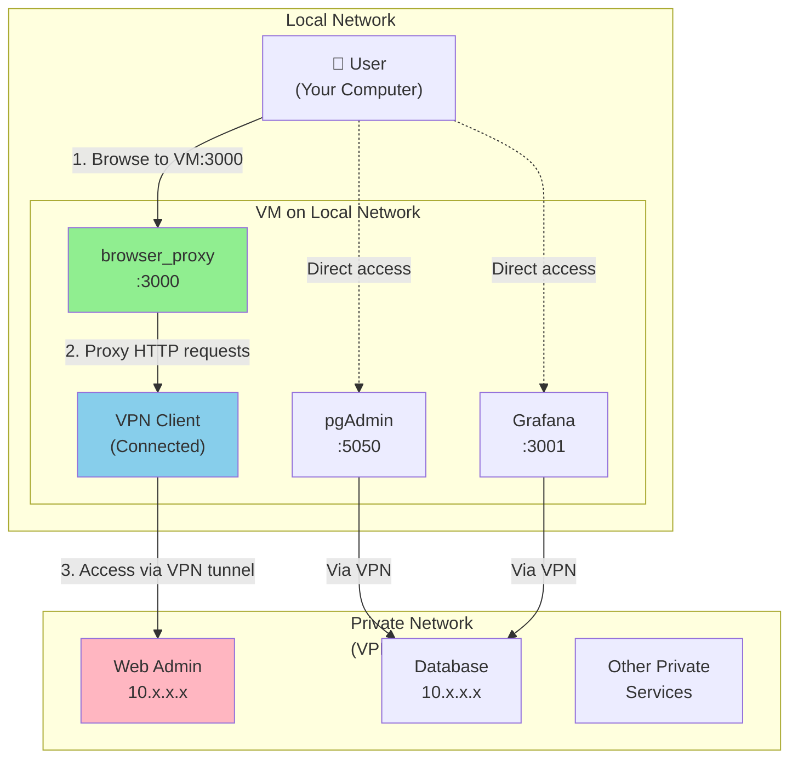

# Browser Proxy

A secure, allowlist-only HTTP/HTTPS proxy server with HTML URL rewriting, built in Rust.

## History

This project is a modern recreation of the original [browser_vpn](https://github.com/glhewett/browser_vpn) Java application, which was created many years ago as an SSL-VPN proof of concept. The original implementation used Java servlets and JSP with regex-based URL rewriting.

This Rust version represents a complete architectural reimagining with significant improvements:

- **Modern async architecture** using Tokio for better performance and concurrency
- **Proper HTML5 parsing** with scraper/html5ever instead of fragile regex patterns
- **Type safety** leveraging Rust's ownership system to prevent entire classes of bugs
- **HTTPS support** for both HTTP and HTTPS target websites
- **Enhanced security model** with strict allowlist-only domain filtering
- **Structured logging** with tracing for better observability
- **Container-first deployment** with Docker and docker-compose support

The core concept remains the same: intercept HTTP requests, fetch content from target servers, rewrite HTML URLs to route through the proxy, and enforce domain access controls. However, the implementation is now production-ready, maintainable, and significantly more secure.

## Security Model: Allowlist-Only Mode

Browser Proxy uses a **strict allowlist-only security model** designed for maximum control over network access.

### Core Principles

1. **Explicit Allow, Default Deny**
   - Every domain must be explicitly added to the allowlist
   - No domain is accessible by default
   - Server refuses to start if allowlist is empty

2. **No Implicit Trust**
   - External resources (CDNs, fonts, images from other domains) are blocked by default
   - Each dependency must be discovered and explicitly allowed
   - Forces intentional security decisions

3. **Blocklist Priority**
   - Domains in the blocklist are denied even if they match allowlist patterns
   - Useful for blocking ads or tracking domains within otherwise trusted domains

4. **Wildcard Support with Caution**
   - Supports patterns like `*.example.com` for subdomains
   - Wildcards should be used carefully as they expand the trust boundary

### How It Works

```toml
[domain_filter]
# REQUIRED: Must have at least one domain
allowlist = [
    "example.com",            # Explicitly trust this domain
    "cdn.example.com",        # External CDN must be added manually
    "fonts.googleapis.com",   # External fonts must be added manually
]

# OPTIONAL: Block specific subdomains
blocklist = [
    "ads.example.com",        # Blocked even though *.example.com might match
    "tracking.example.com",   # Blocked for privacy
]
```

### Discovery Workflow

The allowlist-only model enforces a discovery workflow:

1. **Start Minimal**: Begin with just your primary domain
   ```toml
   allowlist = ["example.com"]
   ```

2. **Browse and Discover**: Access the site through the proxy
   - External resources will be blocked
   - Logs show which domains were blocked

3. **Review Logs**: Check for blocked domains
   ```
   WARN Domain not in allowlist: cdn.example.com
   WARN Domain not in allowlist: fonts.googleapis.com
   ```

4. **Make Informed Decisions**: For each blocked domain:
   - Is this domain necessary?
   - Do I trust this domain?
   - Should I add it to the allowlist?

5. **Update and Restart**: Add trusted domains and restart server

### Why Allowlist-Only?

**Advantages:**
- **Maximum Security**: Nothing is trusted by default
- **Visibility**: Forces awareness of all external dependencies
- **Control**: Explicit approval for every trust relationship
- **Audit Trail**: Logs show all access attempts
- **Data Sovereignty**: Prevents unintended data leakage to third parties

**Trade-offs:**
- **Initial Setup**: Requires discovering and adding all dependencies
- **Maintenance**: Need to restart server to update allowlist
- **User Experience**: External resources initially broken until added

This model is ideal for:
- Security-conscious environments
- Compliance requirements (GDPR, HIPAA, etc.)
- Testing and development
- Analyzing website dependencies
- Restricting access to specific applications

## Installation (Docker)

### Prerequisites

- Docker
- Docker Compose (recommended)

### Quick Start

1. **Clone the repository:**
   ```bash
   git clone https://github.com/glhewett/browser_proxy.git
   cd browser_proxy
   ```

2. **Create environment file:**
   ```bash
   cp .env.example .env
   ```

3. **Configure your allowlist** (edit `.env`):
   ```bash
   # Required: Add your allowed domains
   DOMAIN_FILTER_ALLOWLIST=example.com,cdn.example.com

   # Important: Change default password!
   AUTH_PASSWORD=your-secure-password-here
   ```

4. **Start the proxy:**
   ```bash
   docker-compose up -d
   ```

5. **Access the application:**
   ```
   http://localhost:3000
   ```

   Default login: `admin` / `your-secure-password-here`

### Configuration

All configuration is done via environment variables in `.env`:

```bash
# Server Configuration
SERVER_HOST=0.0.0.0
SERVER_PORT=3000

# Authentication - CHANGE THESE!
AUTH_USERNAME=admin
AUTH_PASSWORD=changeme

# Domain Filter (REQUIRED)
# Comma-separated list of allowed domains
DOMAIN_FILTER_ALLOWLIST=example.com,cdn.example.com,fonts.googleapis.com

# Optional: Block specific domains
DOMAIN_FILTER_BLOCKLIST=ads.example.com,tracking.example.com

# Logging
LOGGING_LEVEL=info
LOGGING_FORMAT=pretty
LOGGING_LOG_REQUESTS=true
```

### Docker Commands

```bash
# Start the proxy
docker-compose up -d

# View logs (watch for blocked domains)
docker-compose logs -f

# Restart after config changes
docker-compose restart

# Stop the proxy
docker-compose down

# Rebuild after code changes
docker-compose build --no-cache
docker-compose up -d
```

### Using Docker Directly

If you prefer not to use docker-compose:

```bash
# Build
docker build -t browser_proxy:latest .

# Run
docker run -d \
  --name browser_proxy \
  -p 3000:3000 \
  -e DOMAIN_FILTER_ALLOWLIST=example.com,cdn.example.com \
  -e AUTH_PASSWORD=your-secure-password \
  browser_proxy:latest

# View logs
docker logs -f browser_proxy

# Stop
docker stop browser_proxy && docker rm browser_proxy
```

## Usage

### Web Interface

1. Open `http://localhost:3000` in your browser
2. Login with your credentials
3. Enter a URL from your allowlist (e.g., `http://example.com`)
4. Browse! All links will automatically route through the proxy

### Direct Proxy Access

You can also access the proxy directly via URL patterns:

- **HTTP:** `http://localhost:3000/proxy/http/example.com/path`
- **HTTPS:** `http://localhost:3000/proxy/https/example.com/path`

### How URL Rewriting Works

The proxy intercepts HTML content and rewrites all URLs to route through itself:

**Original HTML:**
```html
<a href="/about">About</a>

<script src="//example.com/app.js"></script>
```

**Rewritten HTML:**
```html
<a href="http://localhost:3000/proxy/https/example.com/about">About</a>

<script src="http://localhost:3000/proxy/https/example.com/app.js"></script>
```

This ensures all subsequent requests continue through the proxy and are subject to allowlist filtering.

## Common Workflows

### Proxying a New Site

1. Add the primary domain to your allowlist:
   ```bash
   DOMAIN_FILTER_ALLOWLIST=newsite.com
   ```

2. Restart the proxy:
   ```bash
   docker-compose restart
   ```

3. Browse to the site through the proxy

4. Monitor logs for blocked external resources:
   ```bash
   docker-compose logs -f | grep "not in allowlist"
   ```

5. Add necessary external domains to allowlist:
   ```bash
   DOMAIN_FILTER_ALLOWLIST=newsite.com,cdn.newsite.com,fonts.googleapis.com
   ```

6. Restart again:
   ```bash
   docker-compose restart
   ```

### Production Deployment

For production use, we recommend:

1. **Use HTTPS:** Deploy behind a reverse proxy (nginx, Caddy, Traefik)
   ```nginx
   server {
       listen 443 ssl http2;
       server_name proxy.yourdomain.com;

       ssl_certificate /path/to/cert.pem;
       ssl_certificate_key /path/to/key.pem;

       location / {
           proxy_pass http://localhost:3000;
           proxy_set_header Host $host;
           proxy_set_header X-Real-IP $remote_addr;
       }
   }
   ```

2. **Restrict Access:** Bind only to localhost and use firewall rules
   ```bash
   SERVER_HOST=127.0.0.1
   ```

3. **Use Strong Passwords:** Generate secure credentials
   ```bash
   AUTH_PASSWORD=$(openssl rand -base64 32)
   ```

4. **Enable Log Monitoring:** Use structured logging
   ```bash
   LOGGING_FORMAT=json
   ```

5. **Set Resource Limits:** In docker-compose.yml:
   ```yaml
   deploy:
     resources:
       limits:
         cpus: '1'
         memory: 512M
   ```

## Troubleshooting

### External Resources Not Loading

**Problem:** Images or other resources from external domains don't load.

**Solution:** This is expected with allowlist-only mode! Check logs:
```bash
docker-compose logs | grep "not in allowlist"
```

Add the blocked domains to your allowlist and restart.

### "Allowlist cannot be empty" Error

**Problem:** Server fails to start with this error.

**Solution:** Add at least one domain to `DOMAIN_FILTER_ALLOWLIST` in `.env`:
```bash
DOMAIN_FILTER_ALLOWLIST=example.com
```

### Login Not Working

**Problem:** Credentials don't work.

**Solution:**
- Ensure `AUTH_USERNAME` and `AUTH_PASSWORD` in `.env` match what you're entering
- Clear browser cookies
- Check logs: `docker-compose logs`

### Port Already in Use

**Problem:** Error: "address already in use"

**Solution:** Change the port in `.env`:
```bash
SERVER_PORT=3001
```

Then restart: `docker-compose down && docker-compose up -d`

## Features

- **Allowlist-Only Security:** Strict domain filtering, default deny
- **HTML URL Rewriting:** Automatic URL transformation in HTML content
- **HTTP & HTTPS Support:** Proxies both protocols seamlessly
- **Wildcard Patterns:** Support for `*.example.com` domain matching
- **Blocklist Support:** Block specific domains within allowed patterns
- **Web UI:** Clean, modern interface with authentication
- **Session Management:** Secure cookie-based sessions
- **Request Logging:** Structured logs with duration tracking
- **Docker-First:** Optimized for container deployment
- **Environment Config:** 12-factor app methodology

## Security Considerations

### Important Notes

1. **Man-in-the-Middle:** The proxy acts as a MITM for HTTPS traffic
   - It fetches HTTPS content, rewrites it, and serves over HTTP
   - This is necessary for URL rewriting but means the proxy sees all content
   - Deploy behind HTTPS reverse proxy to secure client-to-proxy connection

2. **Session Storage:** Sessions stored in memory, lost on restart
   - For production, consider persistent session store
   - Use sticky sessions with load balancers

3. **JavaScript Limitations:**
   - Dynamically generated URLs cannot be rewritten
   - Client-side JavaScript still subject to browser CORS policies
   - WebSockets not supported

4. **Default Credentials:** Change the default password immediately

### Best Practices

- Always change default password
- Deploy behind HTTPS reverse proxy
- Use firewall rules to restrict access
- Regularly review logs for suspicious activity
- Keep allowlist minimal (principle of least privilege)
- Monitor for blocked domain attempts
- Keep Docker images updated

## Project Structure

```
browser_proxy/
├── src/                    # Rust source code
│   ├── main.rs            # Entry point
│   ├── config.rs          # Configuration
│   ├── routes/            # HTTP routes
│   ├── proxy/             # Proxy core & HTML rewriting
│   └── middleware/        # Domain filter & logging
├── templates/             # Askama HTML templates
├── Dockerfile             # Container image
├── docker-compose.yml     # Orchestration
├── .env.example          # Example configuration
├── config.toml.example   # Alternative config format
└── README.md             # This file
```

## Technical Details

- **Language:** Rust (2021 edition)
- **Web Framework:** Axum (async)
- **HTTP Client:** Reqwest with rustls
- **HTML Parser:** Scraper + html5ever
- **Templates:** Askama
- **Logging:** Tracing
- **Binary Size:** ~8.6MB (release)

## License

BSD 3-Clause License (same as original browser_vpn)

## Credits

- **Original Concept:** browser_vpn by Greg Hewett (Java, 2004-2006)
- **Rust Recreation:** Modern reimplementation with enhanced security model
- **Architecture:** Built with Axum, Tokio, and the Rust ecosystem

## Contributing

Contributions welcome! Please feel free to submit issues or pull requests.

For major changes, please open an issue first to discuss what you would like to change.

## Use Case Example: Secure Access to Private Network Resources

This proxy is particularly useful when you need to access web applications in a private network through a controlled gateway. Here's a real-world deployment scenario:

### Architecture Overview



### How It Works

1. **VM Setup**: A VM on your local network runs:
   - VPN client connected to the private network
   - pgAdmin and Grafana for database/metrics visualization
   - browser_proxy for web application access

2. **Access Flow**:
   - You access `browser_proxy` from your local machine
   - Enter the private web admin URL (e.g., `http://10.x.x.x/admin`)
   - browser_proxy validates the domain against the allowlist
   - Requests are proxied through the VM's VPN connection
   - Private web admin responds via the VPN tunnel
   - HTML is rewritten to route all links through the proxy

3. **Security Layers**:
   - **Authentication**: browser_proxy requires username/password
   - **Allowlist**: Only explicitly allowed domains can be accessed
   - **Local Network**: VM accessible only on your local network
   - **VPN**: Private resources protected behind VPN authentication
   - **Application Auth**: Each service (pgAdmin, Grafana, Web Admin) has its own credentials

### Security Considerations

This setup **increases attack surface** by exposing private network resources through multiple applications. However, it's acceptable in controlled environments when:

- ✅ All applications require strong authentication
- ✅ Services run on a trusted local network
- ✅ VPN connection is properly secured
- ✅ Allowlist is configured to only permit known, trusted domains
- ✅ Regular security updates are applied to all components

**Not recommended** for:
- ❌ Direct internet exposure without additional security layers
- ❌ Production environments with sensitive data requiring compliance
- ❌ Scenarios where end-to-end encryption is mandatory
- ❌ Untrusted networks or shared hosting environments

## Further Documentation

- **DOCKER.md** - Detailed Docker deployment guide
- **QUICKSTART.md** - 1-minute setup guide
- **IMPLEMENTATION_SUMMARY.md** - Technical implementation details
- **config.toml.example** - Alternative TOML configuration format

---

**Note:** This proxy is designed for legitimate use cases such as security testing, development, and controlled access environments. Always respect website terms of service and applicable laws.
